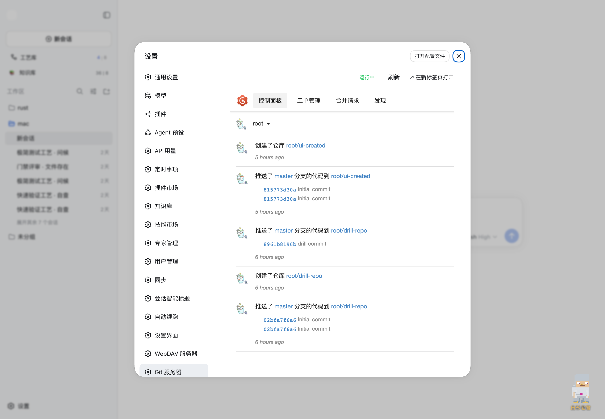
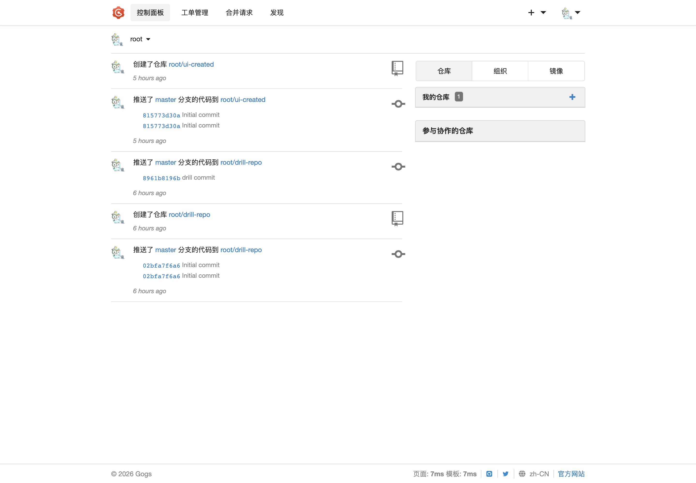
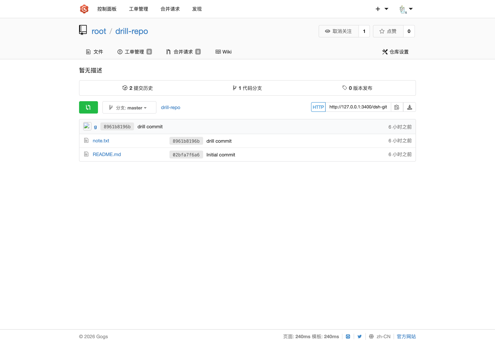
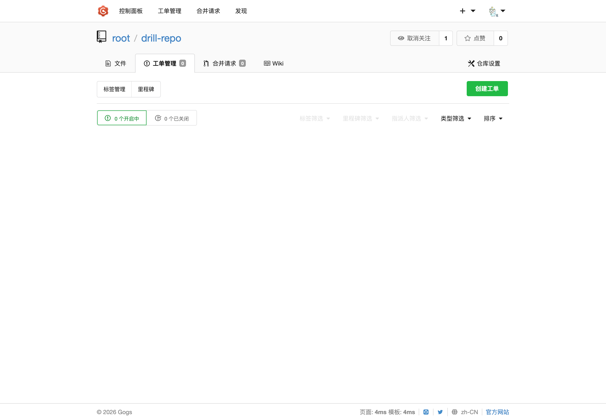
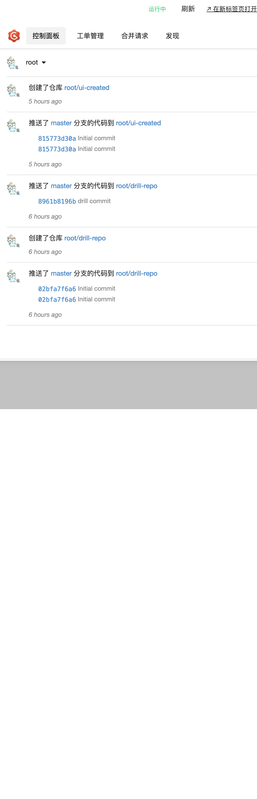

# @weibaohui/dsh-git-server

[](https://www.npmjs.com/package/@weibaohui/dsh-git-server)
[](https://github.com/weibaohui/dsh-git-server/blob/main/LICENSE)

dsh 插件 · Git 服务器：内嵌 [ts-gogs](https://github.com/weibaohui/ts-gogs)（Gogs 的 TypeScript 1:1 平替），把一套**完整的自助 Git 服务**装进 dsh——HTTP clone/push、网页端、issue、PR、wiki、发版、webhook、组织与团队。全部管理在 dsh 设置窗口一站式完成，可选复用 [user-management](https://github.com/weibaohui/user-management) 的用户名密码。

## 这是干什么的

dsh 会话里沉淀的代码、脚本、工作区成果，需要一个**自己的远程 Git 仓库**来托管和沉淀版本历史。GitHub 太远、临时 mkdir 不算仓库——本插件把 ts-gogs 整个跑起来：

- **完整 Git 服务**：网页端（控制面板/仓库/工单/PR/wiki/发版/组织团队）+ HTTP smart协议 clone/push + API v1 + webhook；
- **一键启停**：ts-gogs 作为受管子进程运行（崩溃 3 秒自动拉起），启用/停用/端口/数据目录全在设置页，配置变更 3 秒热生效；
- **界面统一**：完整 gogs 界面通过反向代理嵌入 dsh 设置窗口，浏览器全程只访问 dsh（受 dsh 登录门禁保护），无需另开端口页面；
- **账号打通**：可选复用 user-management 的用户名密码，git 操作和网页登录免另记一套账号。

## 界面

设置 → Git 服务器：完整 gogs 界面内嵌在 dsh 设置窗口里，顶部工具条提供状态、刷新与新标签页打开。



内嵌界面即完整 gogs：控制面板活动流、仓库、工单、PR 全部可交互。



仓库页：文件列表、提交历史、clone 地址、star/watch。



工单页：



展开「配置与管理」：服务/认证/注册/管理员密码与仓库管理（列表、创建、删除）集中在一处。



## 安装

```sh
dsh plugin add github:weibaohui/dsh-git-server
```

重启 dsh 后，打开 **设置 → Git 服务器**。依赖自动处理：首次启动自检运行时依赖（better-sqlite3/ssh2 等），缺失时自动安装，无需手动 `npm install`。

## 快速上手

1. 设置页勾选**启用 Git 服务器**，保存（默认 `127.0.0.1:3400`）；
2. 点内嵌界面的**登录**：`user-management` 模式下直接用 dsh 的用户名密码；`gogs` 模式用管理员 `root` + 设置页展示的密码；
3. 新建仓库（设置页表单或网页端），然后照常开发：

```sh
git clone http://127.0.0.1:3400/root/drill-repo.git
cd drill-repo && git checkout -b feature && ... && git push origin feature
```

4. 浏览器里所有管理操作都在 **dsh 设置 → Git 服务器** 的内嵌界面完成。

## 配置

| 配置 | 默认 | 说明 |
|---|---|---|
| 启用 | 关 | 停用时子进程一并关闭 |
| 监听地址 | `127.0.0.1` | `0.0.0.0` = 局域网可访问（git 操作与网页） |
| 端口 | `3400` | 1024–65535；git remote 与网页都走这里，网页也可走 dsh 反代路径 |
| 数据目录 | `~/.dsh/dsh-git-server/data` | 仓库/数据库/日志（支持 `~`）；改目录=迁移整套数据 |
| 账号体系 | `gogs` | `gogs` 或 `user-management`，见下节 |
| 管理员密码 | 自动生成 | 本库管理员 `root` 的密码，设置页可见可轮换（轮换重启后生效） |
| 开放网页注册 | 开 | 关闭后仅管理员能建号 |

配置存于 `~/.dsh/settings.yaml` 的 `dsh-git-server` 节，3 秒热生效（变更触发子进程重启，毫秒级停顿）。

## 认证：gogs 账号 or user-management 账号

两种账号体系，设置页一键切换：

- **gogs 账号**（默认）：ts-gogs 本库独立账号 + 令牌。管理员 `root` 密码首次启动自动生成（设置页可见），网页注册开放，普通账号自行注册；
- **user-management 账号**：git clone/push 与网页登录直接接受 user-management 的用户名密码（scrypt 口令跨仓复刻验证，映射为本库管理员）。注意事项：
  - 开启两步验证（TOTP）的账号不可用——登录无处输入动态码，这类用户请用 gogs 账号模式；
  - 被禁用的账号同样拒绝；密码修改后旧凭据最多再有效 5 分钟（判定缓存）；
  - user-management 未安装或用户库缺失时**自动回退 gogs 账号模式**，不会把人锁死在外面；
  - `user-management` 模式下内嵌界面**免登录**：代理自动注入会话，打开即是已登录状态。

## 架构：子进程 + 反向代理，为什么不做源码级融合

本插件把 ts-gogs 以**受管子进程**运行（独立端口），dsh 设置窗口通过**流式反向代理**把完整界面收进来——而不是把 ts-gogs 源码拷进插件做进程内融合。取舍如下：

- **隔离性**：git 服务器是重负载组件（原生 sqlite、子进程 hook、可选 SSH）；子进程崩溃只影响 Git 服务（3 秒自动拉起），进程内融合则一崩全崩；
- **Git 协议需要独立端点**：HTTP smart 协议有特殊内容类型与流式语义，且 CLI 凭据模型与网页门禁天然不同——独立端口是 GitHub/Gitea/Gogs 的共同实践，融合反而要为 git 流量单独开口；
- **上游可追踪**：ts-gogs 有 274 例对上游 gogs 的交叉验证测试；源码级深度改造会让后续同步上游修复变成人力工程；
- **代理很薄**：一个 `http.request` 管道（约 60 行），无协议改写；界面统一靠 ts-gogs 原生子路径能力（`EXTERNAL_URL` 子路径 → 链接/资产全带前缀），非运行时 hack。

内嵌界面的**登录摩擦**已通过代理自动注入会话解决（user-management 模式下打开即登录态），不再构成融合的理由。

## 数据与迁移

- 数据目录（默认 `~/.dsh/dsh-git-server/data`）= `gogs.db` + `repositories/` + 日志；备份目录即备份全部；
- 升级插件（ts-gogs 新版本）后数据目录原样沿用，首次启动自动跑 schema 迁移检查。

## 开发

```sh
npm run sync-gogs     # 从 ../ts-gogs 同步构建产物到 vendor/ts-gogs
npm run build:client  # 重新打包设置页 client bundle
npm test              # 合约测试（含真实子进程端到端：clone/push/UM 凭据）
```

运行时依赖（better-sqlite3/ssh2 等）由本包 `dependencies` 提供；缺失时启动自检会自动安装。

## License

MIT
