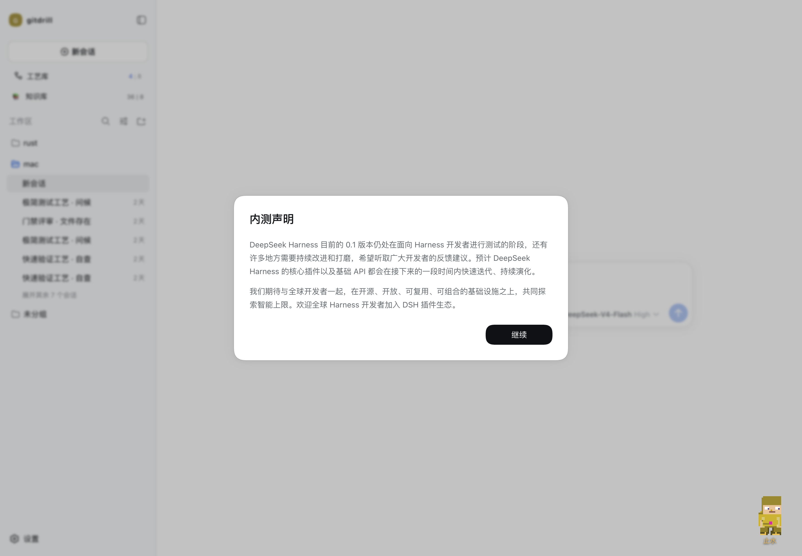
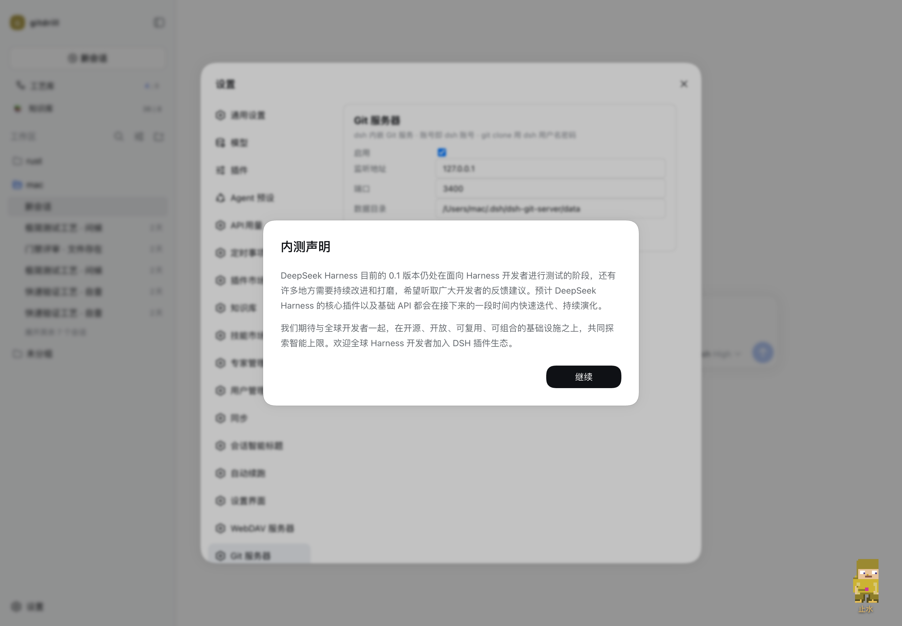

# @weibaohui/dsh-git-server

[](https://www.npmjs.com/package/@weibaohui/dsh-git-server)
[](https://github.com/weibaohui/dsh-git-server/blob/main/LICENSE)

dsh 插件 · Git 服务器：内嵌 [ts-gogs](https://github.com/weibaohui/ts-gogs)（Gogs 的 TypeScript 1:1 平替，源码级融合），把一套**完整的自助 Git 服务**装进 dsh——HTTP clone/push、网页端、issue、PR、wiki、发版、webhook、组织与团队。全部管理在 dsh 设置窗口一站式完成；**账户唯一来源 = user-management**，dsh 用户名密码即 Git 凭据，登录校验直接走 user-management 的 service。

## 这是干什么的

dsh 会话里沉淀的代码、脚本、工作区成果，需要一个**自己的远程 Git 仓库**来托管和沉淀版本历史。GitHub 太远、临时 mkdir 不算仓库——本插件把 ts-gogs 整个跑起来：

- **完整 Git 服务**：网页端（控制面板/仓库/工单/PR/wiki/发版/组织团队）+ HTTP smart协议 clone/push + API v1 + webhook；
- **一键启停**：ts-gogs 作为受管子进程运行（崩溃 3 秒自动拉起），启用/停用/端口/数据目录全在设置页，配置变更 3 秒热生效；
- **界面统一**：完整 gogs 界面通过反向代理嵌入 dsh 设置窗口，浏览器全程只访问 dsh（受 dsh 登录门禁保护），无需另开端口页面；
- **账号打通**：可选复用 user-management 的用户名密码，git 操作和网页登录免另记一套账号。

## 界面（dsh 原生插件 UI）

前端不再内嵌内核网页，而是**dsh 插件原生界面**：React + dsh 主题 token（`--dsw-alias-*`，亮暗自动跟随）、dsh locale（zh/en）、经宿主同源 API 通信——零 iframe、零桥接。

- **侧栏底部「Git」入口 → 全屏管理页**：仓库列表（建仓/删除/星标工单计数）→ 仓库浏览四个标签页（**文件**树+文件内容、**提交**历史、**分支**、**工单**列表/新建/评论/关闭）。数据按当前 dsh 登录用户身份执行（权限即本人权限）。



- **设置 → Git 服务器**：服务配置（启停/监听/端口/数据目录）。



- **进阶页面**（PR 评审、wiki、发版、组织）经「高级页面 ↗」直达内核网页端（同一 dsh 账号登录）。

## 安装

```sh
dsh plugin add github:weibaohui/dsh-git-server
```

重启 dsh 后，打开 **设置 → Git 服务器**。依赖自动处理：首次启动自检运行时依赖（better-sqlite3/ssh2 等），缺失时自动安装，无需手动 `npm install`。

## 快速上手

1. 设置页勾选**启用 Git 服务器**，保存（默认 `127.0.0.1:3400`）；
2. 点内嵌界面的**登录**：直接用 dsh 的用户名密码（user-management service 校验）——打开内嵌界面时通常已自动登录；
3. 新建仓库（设置页表单或网页端），然后照常开发：

```sh
git clone http://127.0.0.1:3400/root/drill-repo.git
cd drill-repo && git checkout -b feature && ... && git push origin feature
```

4. 日常操作在 **侧栏 → Git** 全屏页完成；进阶功能（PR/wiki/发版）点右上「高级页面」直达内核网页端。

## 配置

| 配置 | 默认 | 说明 |
|---|---|---|
| 启用 | 关 | 停用时子进程一并关闭 |
| 监听地址 | `127.0.0.1` | `0.0.0.0` = 局域网可访问（git 操作与网页） |
| 端口 | `3400` | 1024–65535；git remote 与网页都走这里，网页也可走 dsh 反代路径 |
| 数据目录 | `~/.dsh/dsh-git-server/data` | 仓库/数据库/日志（支持 `~`）；改目录=迁移整套数据 |
| 管理员密码 | 自动生成 | 兜底管理员 `root` 的密码（仅在 user-management 用户库缺失时作为紧急登录），设置页可见可轮换 |

配置存于 `~/.dsh/settings.yaml` 的 `dsh-git-server` 节，3 秒热生效（变更触发子进程重启，毫秒级停顿）。

## 账户：唯一来源 = user-management

dsh-git-server 不设独立账号体系。网页登录、git HTTP Basic、API Basic 的凭据都由 [user-management](https://github.com/weibaohui/user-management) 的用户库验证：

- **service 注入**：启动时自动定位 dsh profile 安装的 user-management store 模块并注入子进程，登录走 `store.checkLogin`（与 UM 网关同一代码路径）；外部建号/改密/禁用通过 users.json 指纹自动感知；
- **影子账号**：UM 用户验证通过时自动维护同名本库账号（仓库所有权/令牌归属的载体，UM admin → Git 管理员）；**密码永不同步**——passwd 是随机不可用占位，任何登录路径都不校验它；
- **注册关闭**：网页注册强制禁用，账号只能由 user-management 管理（UM 管理员在 dsh 的用户管理界面建号）；
- **自动登录**：从 dsh 打开内嵌界面时按 dsh 会话注入对应身份，打开即已登录；
- **回退保护**：user-management 用户库缺失/损坏时，回退到兜底管理员 `root`（设置页展示的密码），不会把人锁死在外面。

> ⚠️ UM 侧删除用户不会级联删除 Git 账号（该账号的仓库历史仍保留）；如需彻底清理请在内嵌管理界面手动处理。

## 架构：子进程 + 反向代理，为什么不做源码级融合

本插件把 ts-gogs 以**受管子进程**运行（独立端口），dsh 设置窗口通过**流式反向代理**把完整界面收进来——而不是把 ts-gogs 源码拷进插件做进程内融合。取舍如下：

- **隔离性**：git 服务器是重负载组件（原生 sqlite、子进程 hook、可选 SSH）；子进程崩溃只影响 Git 服务（3 秒自动拉起），进程内融合则一崩全崩；
- **Git 协议需要独立端点**：HTTP smart 协议有特殊内容类型与流式语义，且 CLI 凭据模型与网页门禁天然不同——独立端口是 GitHub/Gitea/Gogs 的共同实践，融合反而要为 git 流量单独开口；
- **上游可追踪**：ts-gogs 有 274 例对上游 gogs 的交叉验证测试；源码级深度改造会让后续同步上游修复变成人力工程；
- **身份链**：dsh 登录会话经 user-management 网关以 `x-um-session` 头转发到宿主；宿主解析出用户名后以其身份在内核铸个人令牌并代理 API——每一步都是本人权限，无全局管理员透传。
- **代理很薄**：一个 `http.request` 管道（约 60 行），无协议改写；界面统一靠 ts-gogs 原生子路径能力（`EXTERNAL_URL` 子路径 → 链接/资产全带前缀），非运行时 hack。

同时本包**直接拥有 ts-gogs 源码拷贝**（`server/` 目录，一次性导入后自主演进）：这份拷贝是 dsh 内部私有内核，不再对外开放、不追踪上游——定制全部以减法落在拷贝里。已铲除：安装向导、外部登录源（admin/auths）、网页注册路由、Gogs 本地两步验证、SSH 全套面（内置 SSH 服务/authorized_keys 写入/serv 入口/SSH 密钥管理页与 API/部署密钥/ssh2 依赖）、Gogs 品牌与外链（改为 dsh Git）。后续定制继续在拷贝内做减法。

内嵌界面的**登录摩擦**已通过代理自动注入会话解决（user-management 模式下打开即登录态），不再构成融合的理由。

## 数据与迁移

- 数据目录（默认 `~/.dsh/dsh-git-server/data`）= `gogs.db` + `repositories/` + 日志；备份目录即备份全部；
- 升级插件（ts-gogs 新版本）后数据目录原样沿用，首次启动自动跑 schema 迁移检查。

## 开发

```sh
npm run build:server  # 构建 server/（拷贝的 ts-gogs 源码）
npm run build:client  # 重新打包设置页 client bundle
npm test              # 合约测试（含真实子进程端到端：clone/push/UM 凭据/密码对齐）
```

server/ 内是 ts-gogs 源码拷贝（含构建产物 dist/），运行时依赖（better-sqlite3/ssh2 等）由本包 `dependencies` 提供；缺失时启动自检会自动安装。

## License

MIT
